# Reardz

Take a look at the deployed app: [Readerz](https://readrz-1bd3cc625808.herokuapp.com/)
Take a look at the deployed api: [api](https://reading-media-api-9661e3dfdf56.herokuapp.com/)

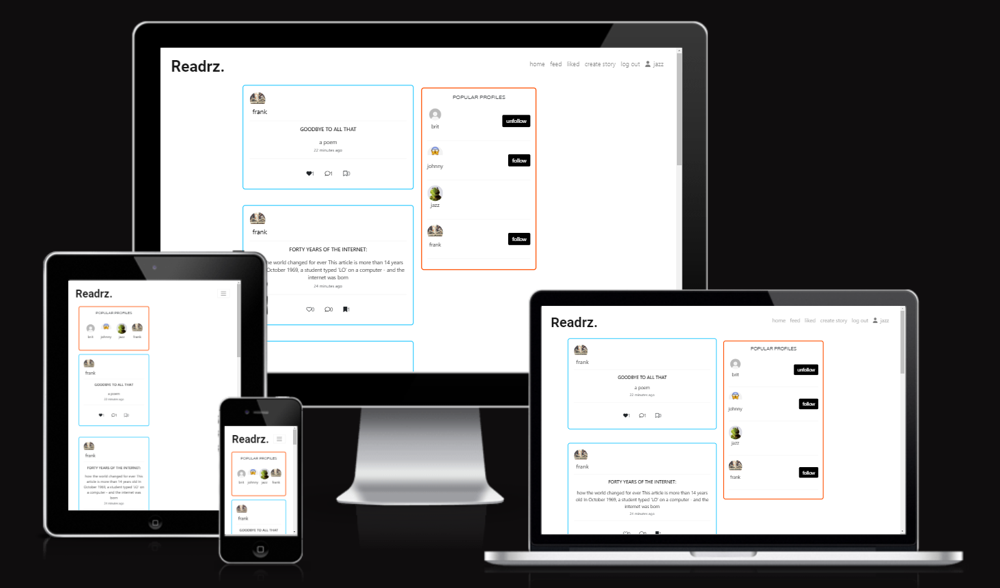

Readrz is a social media app where users can share and read stories and interact with other users. Users can register for an account which gives them access to the full functionality of the app. With a Readrz account a user can:

* Create, edit and delete stories.
* Like / unlike other user’s stories.
* Create, edit and delete comments on stories.
* Like / unlike other user’s comments 
* Create, edit and delete replies to comments  
* Like other user’s comments. 
* See other users stories 
* See other users comments 
* See other users replies 
* Like other users replies
* Follow / unfollow users 
* Save / unsave stories 
* Edit the profile image, name, username, password and about me.

These are images of the initial wireframes for  my project. I created the wireframes using a platform called [Miro](https://miro.com/).

## Features:

#### Sign up page

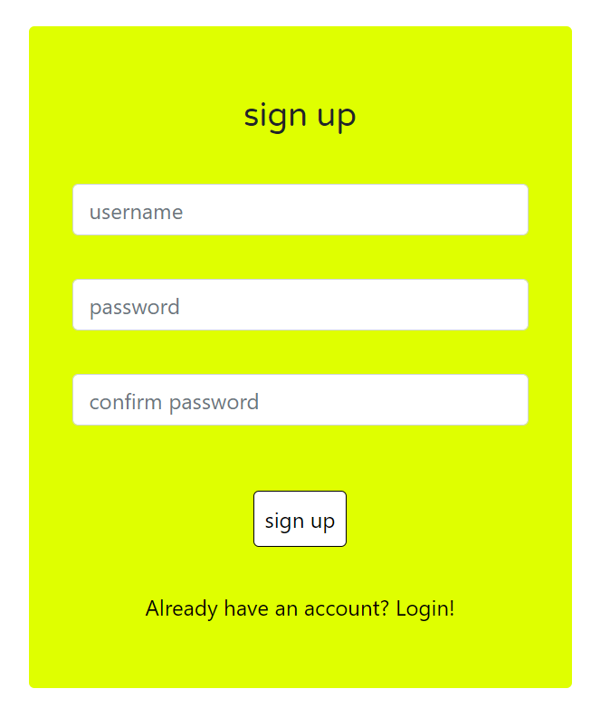

* It allows the user to sign up for a Readrz account.
* The user will be asked to provide their username, password and to confirm their password. 
* The registration form gives the user the chance to join Readrz and  have full access to the app.

#### Login page 

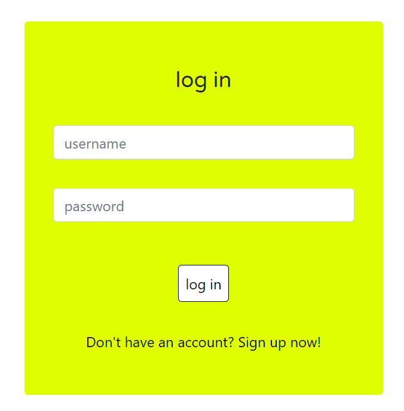

* It allows the user to login to their Readrz account  and  gain access to their profile.
* Once the user has logged in, the user has access to all the navbar links.

#### Navigation
* The navigation bar is situated at the top of each page and contains the website logo which links to the home page.
* If the user is logged in the navigation bar contains links to the create story, home, liked, feed, log out and the logged in user’s username which is a link to their profile.

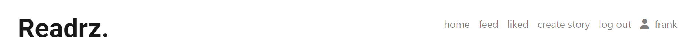

* If the user is not logged in the navbar contains links to home, about us, log in and sign up.
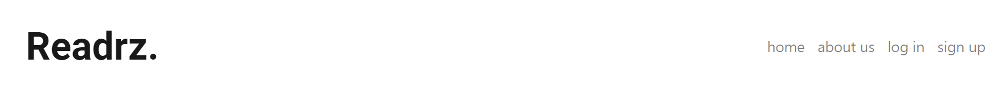

* The navigation bar gives the user easy access to each part of the website, on all devices.

#### Home page
* The home page can be accessed via the app logo or the home link in the navbar.
* The home page contains a list of all the stories.Each story contains: the story author's profile image and username which links to their profile, the story title, the story description,the time the story was last edited and like, comment and save buttons.
* The home page also contains a list of the most popular profiles to follow.

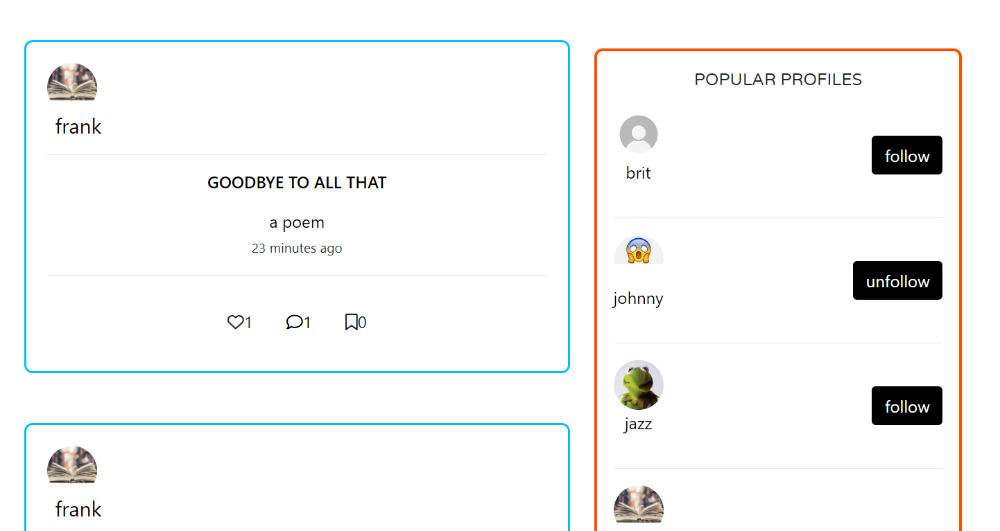

#### Feed page
* The feed page can be accessed via the feed link in the navbar.
* The feed page contains a list of stories created by users that the logged in user follows.
* The feed page also contains a list of the most popular profiles to follow.

#### Liked page
* The liked page can be accessed via the liked link in the navbar.
* The liked page contains a list of stories liked by the logged in user.
* The liked page also contains a list of the most popular profiles to follow.

#### About Us page
* The about us page contains a brief description of the Readrz app, a section about community, one about the advantages and one about the app guidelines.
* The about us page is accessible to users that are not signed up to the app or that are logged out.

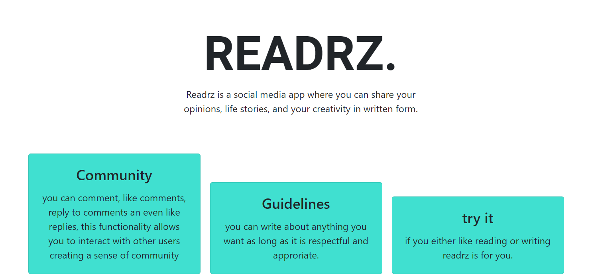

#### Story page
* The story page can be accessed by clicking on the story body(title or description) or the comment button. 
* If the user is also the author of the story there will be an icon next to the username that opens a dropdown menu which allows the user to edit or delete the story.
* The story author can edit or delete their story via a dropdown menu that can be accessed via an icon next to the author’s username on the post.
* The edit form fields are  pre populated  with the previous content and there are buttons to  cancel  or save changes.

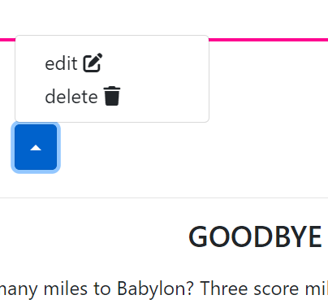

* Via the like button the user can like and unlike a story, consequently the like count will increase or decrease by one.
* Via the save button the user can save stories.
In the story page the user will have access to the comment section.

#### Comment section
* If the user is not logged in, there’ll be a  message letting them know to login in order to create a comment.
* If the user is logged in and there are no comments there will be a message suggesting that the user leave one via the form. If there are any comments they will appear under the form. 
* Each comment is composed of: comment author’s profile picture and username, the comment, the time the comment was last updated, the like and reply buttons. 
* The comment author can edit or delete their comment via a dropdown menu that can accessed via an icon next to the author’s username on the comment.

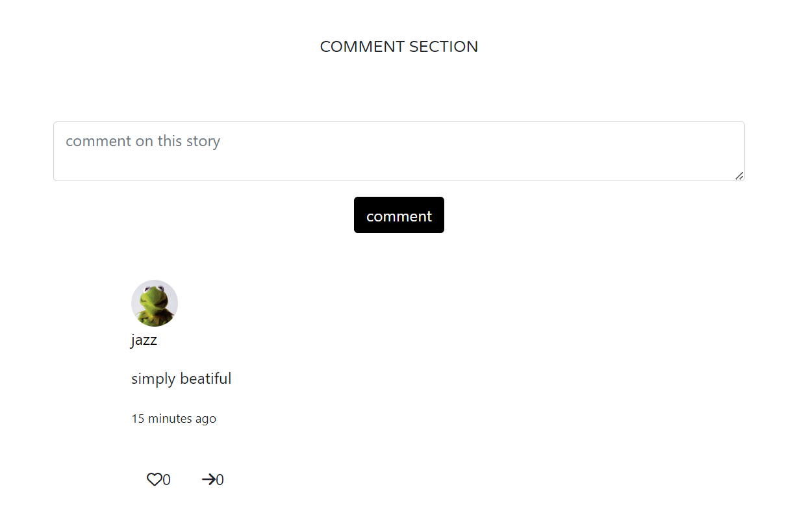

* The edit form fields are  pre populated with the previous content  and there are buttons to  cancel  or save changes. 
* Via the like button the user can like and unlike comments consequently the like count will increase or decrease by one.
* Once the reply button is clicked the comment reply form appears and all the previous replies to the comment appear if there are any. Via the reply form the user can create a reply. 
[screenshots of a reply  ]
* The reply author can edit or delete their reply via a dropdown menu that can accessed via an icon next to the author’s username on the reply
* The edit form fields are  pre populated with the previous content and there are buttons to  cancel  or save changes. 

#### Popular profiles section 
* The popular profiles section appears on the home, feed and liked pages.
* The section contains a list of popular profiles that can be followed and unfollowed via the  buttons.
* On desktop the popular profiles section appears to the right of the stories
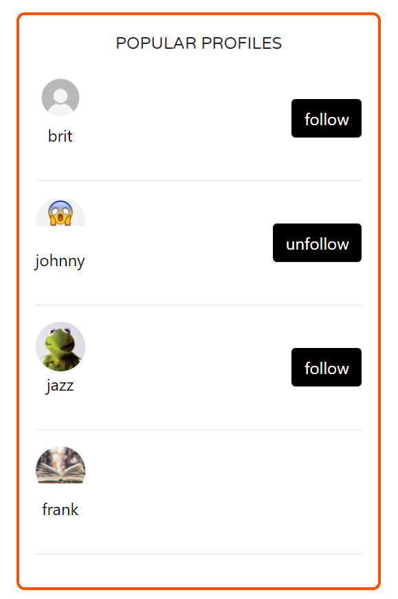

* On mobile the popular profiles section appears at the top of the page. 
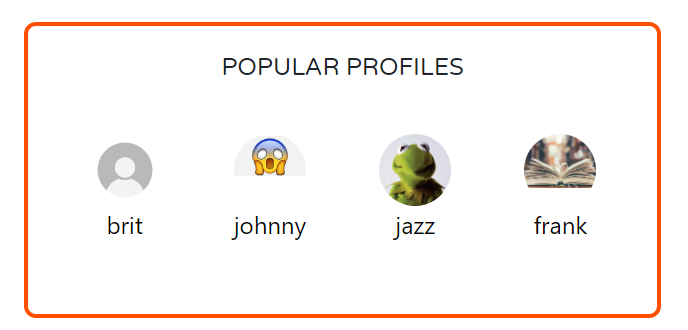

#### Profile page
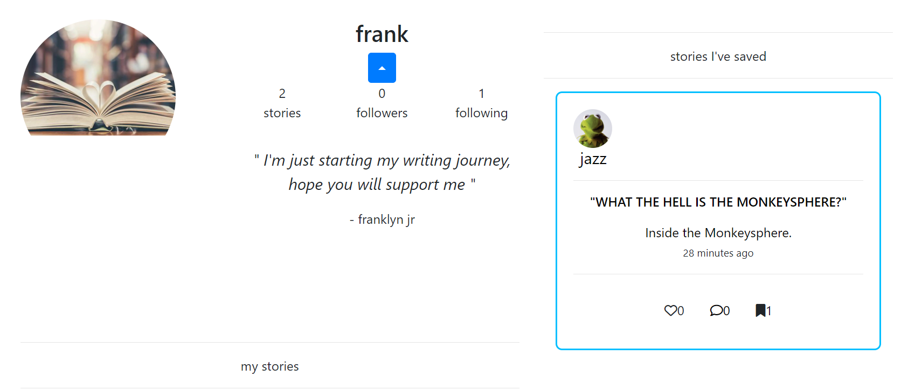

* The user’s profile page is reached via the link in the navbar. 
* All profiles can be reached by clicking any of the profile pictures and usernames around the app (popular profiles, stories, comments, replies).  
* The profile page contains: an enlarged profile picture, the number of stories a user has created, the number of followers the user has and the number of profiles the user follows, the user’s name and an about me section. There’s also a follow/unfollow button.On the same page there’s a list of stories created by the user.
* The profile page contains a list of stories saved by the user.

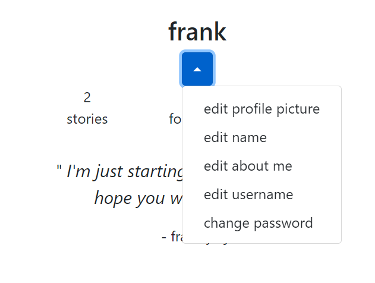

* The profile owner can edit their profile picture, name, about me, username and password via a drop down menu. 
* The edit form fields are  pre populated with the previous content and there are buttons to  cancel  or save changes. 

#### Create story page 
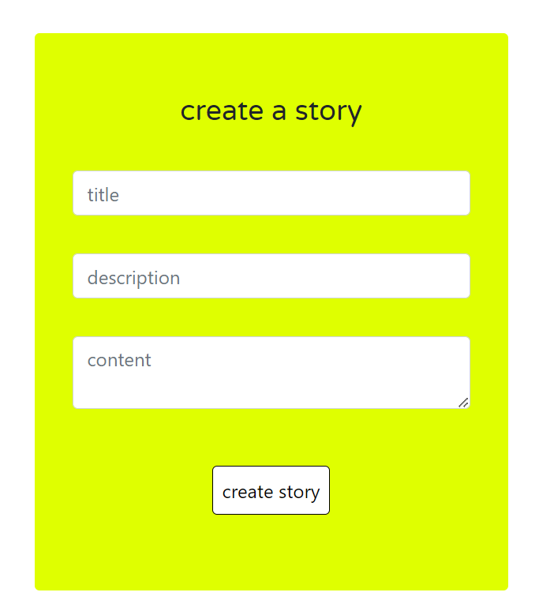

* It allows the user to create a story. Each story can contain a title description and content. 

## React components 

This is the component structure that was used to create the frontend. 
App.js is the default  main component and is also the parent component of NavBar which contains Routes to various other components such as:
* StoryList (allows the user see stories listed in the home, liked and feed pages)
* LoginForm (allows the user to log in to the app)
* SignUpForm (allows the user to sign up to the app)
* CreateStory(allows the user to create stories)
* StoryPage (allows the user to see a story in more detail including the comment section)
* StoryEditForm (allows the user to edit one of their stories)
* ProfilePage (allows the user to view their own profile and other’s profiles)
* ProfileImageEditForm (allows the user to edit their profile image)
* ProfileNameEditForm (allows the user to edit their profile name)
* ProfileAboutUsEditForm (allows the user to edit their profile iabout me)
* UsernameForm (allows the user to change their username)
* PasswordForm (allows the user to change their password)
* SavedStories(shows the stories a user has saved)
* PopularProfiles(allows the user to view profiles and follow them)
* Story(creates the structure of the post)
* StoryDetail(contains the story content)
* Asset(is used as a loading spinner and can output a message)
* Profile(creates the structure of the profile)
* Comment(creates the structure of the comment)
* Reply(creates the structure of the reply)
* CreateComment(allows the user to create a comment)
* CommentEditForm(allows the user to edit their comments)
* CreateReply(allows the user to create a reply)
* ReplyEditForm(allows the user to edit their replies)

## Frontend testing

| action | expected behaviour | pass/fail |
|--------|--------------------|-----------|
| Enter URL in browser | the home page of the website should display on the screen | pass |
| Click Sign up in the navigation bar | You should be redirected to the sign up form | pass |
| Click the sign up button in the sign up form | the user should be redirected to the sign in form | pass |
| Click Sign in in the navigation bar | You should be redirected to the sign in form | pass |
| Click the sign in button in the sign in form | the user should be redirected to the home page and their username should appear in the navbar | pass |
| Click About us on the navigation bar | the user should be redirected to the about us page | pass |
| Click the logo on the navbar | the home page should appear on the screen | pass |
| Click create story on the navigation bar | The user should be redirected to  the create story form | pass |
| Click liked on the navigation bar | the user should be redirected to the liked page where All the stories that have been liked by the logged in user should appear | pass |
| Click feed on the navigation bar | the user should be redirected to the feed page where all the stories by users the user follows should appear | pass |
| Click the profile username on the nav bar | the user should be redirected to their profile page | pass |
| Click sign out on the navigation bar | The user is now logged out, redirected to the home page where they should only see “log in”, “sign up”, “about us” and “home” in the navigation bar | pass |
| Click the dropdown icon in the profile page | These options should appear: edit profile image, edit name, edit about me ,edit username and change password. | pass |
| Click edit profile | the user should be redirected to a pre populated form were they can edit their profile picture | pass |
| Click edit name | the user should be redirected to a pre populated form were they can edit their name | pass |
| Click edit about me | the user should be redirected to a pre populated form were they can edit their about me | pass |
| Click edit username | the user should be redirected to a pre populated form were they can edit their username | pass |
| Click change password | the user should be redirected to a form were they can change their password | pass |
| Click the ‘follow’/’unfollow’ button | The follow button will become an unfollow button and vice versa | pass |
| Click the “like” button under the story or comment or reply | The like count should go up. If the button gets clicked again the count should go down. | pass |
| Click the save button under a story | the story should be saved to the users personal library which can be found in the user’s profile. | pass |
| Click the comment button under the story | you should be redirected to the story page where the comment section will be visible. | pass |
| Click the comment button in the create comment form | the comment count should increase by one and a comment should appear in the comment section. | pass |
| Click the dropdown menu next to the username on the story, comment or reply if the user is the author | Two options should appar: “edit”, “delete”. | pass |
| Click the “edit” link | The user should be redirected to a form to edit the story, comment or reply | pass |
| Click the save button | the post, common or reply should appear edited | pass |
| Click the cancel button | the user should be taken back to the story, comment or reply without making any changes | pass |
| Click  “delete” | the story, comment or reply should be removed from the app | pass |
| Click the reply icon underneath a comment | the reply form should appear and if there are any previous replies they’ll appear too. | pass |
| Click the hide button | the reply form should disappear and if there are any previous replies they should disappear too. | pass |

I created some automated tests for the forms present in the app by using the msw library. The tests are run in the terminal with "npm test".

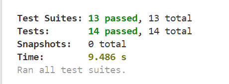

I tested my app's performance, accessibility, SEO and best practices on devtool's lighthouse.

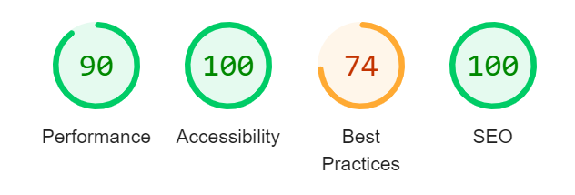

## Api testing 

| action | expected behaviour | pass/fail |
|--------|--------------------|-----------|
| Enter the url in browser | the user should see this welcome message - "message": "Welcome to my django rest framework API!" | pass |
| Enter url/profiles | the user should see a list of user profiles, each profile should have these fields: "Id", "owner", "name”, "about_me", “image”, “created_at”, “updated_at”, “is_owner”, “following_id”, “story_count”, “followers_count”, following_count”. | pass |
| As a logged in user enter url/profiles/your profile id | you should be able to edit these fields: “name”, “about_me”, “image”. | pass |
| Enter url/stories | the user should see a list of user stories, each story should have these fields: "Id", "owner", “created_at”, “updated_at”, “title”, “content”, “description”, “is_owner”, ”profile_id”, “profile_image”, “like_id”, “likes_count”, “comments_count”, “save_id”, “save_count”. | pass |
| Enter url/stories as a logged in user | you should be able to create a story via the form. | pass |
| As a logged in user enter url/stories/your story id | you should be able to edit these fields: “title”, “content”, “description”. You should also be able to delete the story. | pass |
| Enter url/likes | The user should see the list of like instances on the stories. Each instance should have these fields: "Id", "owner", “created_at”, “story”. | pass |
| Enter url/likes as a logged in user | you should be able to create a like instance via the form. | pass |
| Try to create multiple like instances on a story | you should see this error message -  "detail": "duplicate like" | pass |
| As a logged in user enter url/likes/your like id | you should be able to delete the like instance. | pass |
| Enter url/comments | the user should see a list of user comments, each comment should have these fields: "Id", "owner", ”profile_id”, “profile_image”,  “content”, “created_at”, “updated_at”, “is_owner”, “story”, “comment_like_id”, “comment_likes_count”, “comment_reply_count”. | pass |
| Enter url/comments as a logged in user | you should be able to create a comment via the form. | pass |
| As a logged in user enter url/comments/your comment id | you should be able to edit these fields: “content”.You should also be able to delete the comment. | pass |
| Enter url/comment_likes | The user should see the list of like instances on the comments. Each instance should have these fields: "Id", "owner", “created_at”, “comment”. | pass |
| Enter url/comment_likes as a logged in user | you should be able to create a like instance on a comment via the form. | pass |
| Try to create multiple like instances on a comment | you should see this error message - "detail": "duplicate like" | pass |
| As a logged in user enter url/comment_likes/your comment like id | you should be able to delete the comment like instance. | pass |
| Enter url/replies | the user should see a list of user replies to comments , each reply should have these fields: "Id", "owner", ”profile_id”, “profile_image”,  “content”, “created_at”, “updated_at”, “is_owner”, “comment”, “reply_like_id”, “reply_likes_count”. | pass |
| Enter url/replies as a logged in user | you should be able to create a reply via the form. | pass |
| As a logged in user enter url/replies/your reply id | you should be able to edit these fields: “content”.You should also be able to delete the reply. | pass |
| Enter url/reply_likes | The user should see the list of like instances on the replies. Each instance should have these fields: "Id", "owner", “created_at”, “reply”. | pass |
| Enter url/reply_likes as a logged in user | you should be able to create a like instance on a reply  instance via the form. | pass |
| Try to create multiple like instances on a reply | you should see this error message - "detail": "duplicate like" | pass |
| As a logged in user enter url/reply_likes/your reply like id | you should be able to delete the reply like instance. | pass |
| Enter url/saves | The user should see the list of save instances on the stories. Each instance should have these fields: "Id", "owner", “created_at”, “story”. | pass|
| Enter url/saves as a logged in user | you should be able to create a save instance via the form. | pass |
| Try to create multiple save instances on a story | you should see this error message - "detail": "duplicate save" | pass |
| As a logged in user enter url/saves/your save id | you should be able to delete the save instance. | pass |
| Enter url/followers | the user should see a list of user follower instances, each follower instance should have these fields: "Id", "owner", “created_at”, “followed_name”, “followed”. | pass |
| Enter url/followers as a logged in user | you should be able to create a follow instance via the form. | pass |
| Try to create multiple save instances on a story | you should see this error message - "detail": "already following" | pass |
| As a logged in user enter url/followers/your follower id | You should also be able to delete the follower instance. | pass |
| Enter incorrect url pattern | you should see error 404(page not found) | pass |

I’ve created automated tests for all the api models. The tests for each app are stored in the test.py file. The tests  are run by entering “python manage.py test” in the terminal.

## Frontend libraries
* React bootstrap 4: React Bootstrap is a library of reusable components that are already styled.
* Axios : Axios is a library that serves to create HTTP requests that are present externally. Axios serves as a bridge of communication between the frontend and the backend.
* Msw(mock service worker): msw is an api mocking library, which makes testing react components a lot easier by intercepting network requests.
* React infinite scroll: react-infinite-scroll-component is a library that allows for infinite scrolling, the content gets loaded as the user scrolls on the screen.

## API Deployment
* I made sure the libraries used were stored in the requirements.txt file.
* I navigated to heroku, I logged in and I clicked on "create an app", I named the app and selected my region.
* I navigated to the settings and added the config vars I needed. (ALLOWED_HOSTS, CLIENT_ORIGIN, CLIENT_ORIGIN_DEV, CLOUDINARY_URL, DATABASE_URL, DISABLE_COLLECTSTATIC, SECRET_KEY)
* I then navigated to the deploy tab, connected my heroku project to my github repository.
* I then manually deploy my project.

## Frontend deployment
* I navigated to heroku, I logged in and I clicked on "create an app", I named the app and selected my region.
* I then navigated to the deploy tab, connected my heroku project to my github repository.
* I then manually deploy my project.

## Credits:
* Colours: [coolers](https://coolors.co/), the main colours used where white and black with pops of bright colours like blue, yellow, red 
* Fonts: [google fonts](https://fonts.google.com/)
* Asset.js for the loading spinner from the code institute moments walkthrough.
* Utils.js for infinite scroll from the code institute moments walkthrough.
* useRedirect.js for user redirection from the code institute moments walkthrough.
* [Elephantsql](https://www.elephantsql.com/) was my chosen database.
* [Cloudinary](https://cloudinary.com/) was used for image storage.
* Articles for the stories were taken from [the electric typewriter](https://tetw.org/Greats)